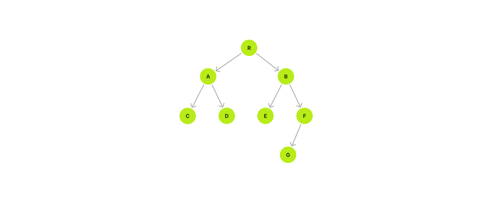

# Binary Tree Data Structure
A Binary Tree is a type of tree data structure where each node can have a maximum of two child nodes, a left child node and a right child node.

## Types
### Balanced
A balanced Binary Tree has at most 1 in difference between its left and right subtree heights.


### Complete
A complete Binary Tree has all levels full of nodes, except the last level, which is can also be full, or filled from left to right. The properties of a complete Binary Tree means it is also balanced.



### Full
A full Binary Tree is a kind of tree where each node has either 0 or 2 child nodes.


### Perfect
A perfect Binary Tree has all leaf nodes on the same level, which means that all levels are full of nodes, and all parent/internal nodes have two child nodes.The properties of a perfect Binary Tree means it is also full, balanced, and complete.


### Degenerate / Pathological
Degenerate binary tree has only one child node to each parent nodes.


## Traversal
### Pre-order Traversal
Pre-order Traversal is a type of Depth First Search. It's done by visiting the root node first, then recursively do a pre-order traversal of the left subtree, followed by a recursive pre-order traversal of the right subtree.

> Usage: Creating a copy of the tree, prefix notation of an expression tree, etc.


```php
class Node
{
    public ?Node $left = null;
    public ?Node $right = null;

    public function __construct(public string $data) {}
}

function preOrderTraversal(?Node $node): void
{
    if ($node === null) {
        return;
    }

    echo "{$node->data}, ";

    preOrderTraversal($node->left);
    preOrderTraversal($node->right);
}

$root = new Node("R");
$nodeA = new Node("A");
$nodeB = new Node("B");
$nodeC = new Node("C");
$nodeD = new Node("D");
$nodeE = new Node("E");
$nodeF = new Node("F");
$nodeG = new Node("G");

$root->left = $nodeA;
$root->right = $nodeB;

$nodeA->left = $nodeC;
$nodeA->right = $nodeD;

$nodeB->left = $nodeE;
$nodeB->right = $nodeF;

$nodeF->left = $nodeG;

preOrderTraversal($root);
```

Output:
```txt
R, A, C, D, B, E, F, G,
```
